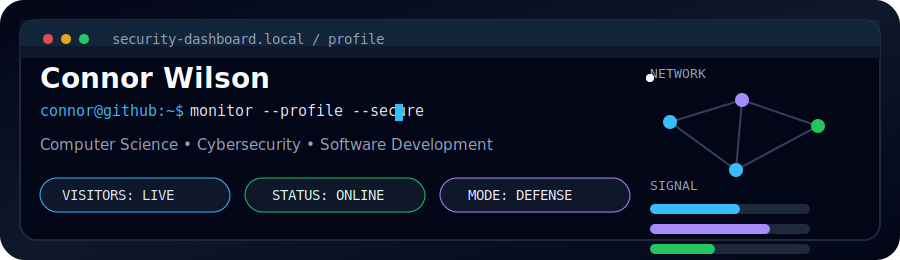
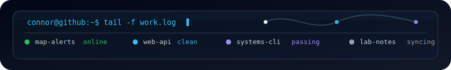

<p align="center">
  
</p>
<p>
  
  
  
  
  
  
  
  <!--img src="https://img.shields.io/badge/Node.js-1F2937?style=for-the-badge&logo=nodedotjs&logoColor=5FA04E" alt="Node.js"-->
  
  
  <!--img src="https://img.shields.io/badge/HTML/CSS-334155?style=for-the-badge&logo=html5&logoColor=white" alt="HTML and CSS"-->
  
</p>


## About

I'm Connor Wilson, a Computer Science student interested in cybersecurity, systems, and software engineering. I like projects that turn messy workflows into clear, repeatable tools.

My work leans practical: readable code, useful automation, observability, and defensive thinking.

```yaml
focus: practical security + software engineering
builds: automation, mobile tools, web apps, systems utilities
values: readable code, repeatable workflows, defensive thinking
```

## Featured Systems

- **mobile-map-app** - SwiftUI/MapKit location alerts and local-first logging.
- **web-apps** - React/Vite frontends backed by Node.js and Express APIs.
- **systems-tools** - Unix-style tooling, process workflows, threading, and compression.
- **blue-team-labs** - Triage notes, alert logic, behavior review, and response practice.

## Currently Building

- SwiftUI map tooling with local GPS alerting.
- Automation scripts for cleanup, testing, and repeatable workflows.
- Defensive analysis notes around triage, alert quality, and response workflows.

## Current Interests

<p>
  
  
  
  
  
  
  
  
</p>

## Technologies

Git | Linux | VS Code | GitHub | React | Node.js | Express | Vite | SwiftUI | MapKit | CoreLocation | Playwright | EF Core | SQL Server

## Connect

- GitHub: [cnrwxlsn](https://github.com/cnrwxlsn)
- Project context: See pinned repositories below

<p align="center">
  
</p>
