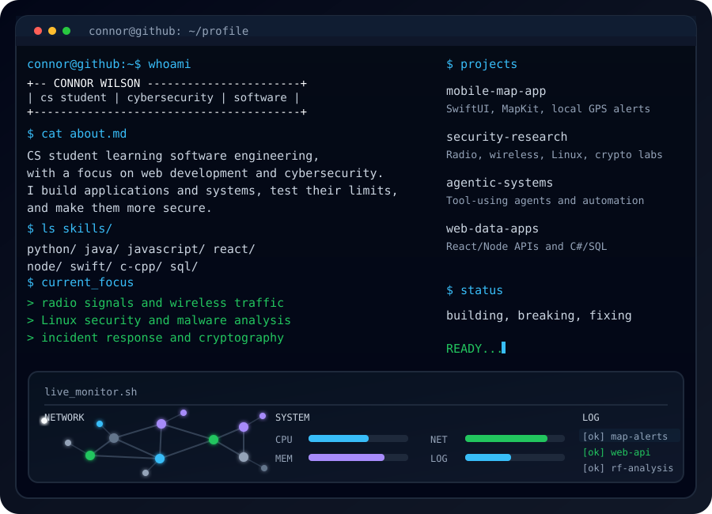
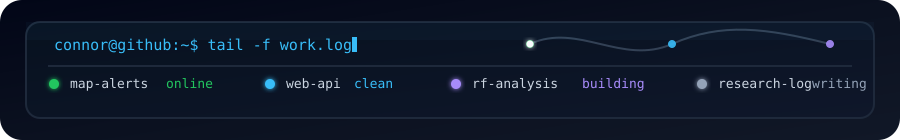

  

  
  
  
  
  
  
  
  <!--img src="https://img.shields.io/badge/Node.js-1F2937?style=for-the-badge&logo=nodedotjs&logoColor=5FA04E" alt="Node.js"-->
  
  
  <!--img src="https://img.shields.io/badge/HTML/CSS-334155?style=for-the-badge&logo=html5&logoColor=white" alt="HTML and CSS"-->
  

## About

Hey, I'm Connor. I'm a Computer Science student leaning more into cybersecurity and security research while still building software.

I'm especially interested in radio and wireless systems, network traffic, Linux security, malware analysis, incident response, and cryptography. I like learning by testing things myself, seeing how they work, and writing down what I find.

## Featured Work

- **security-research** - Radio and wireless systems, traffic analysis, Linux security labs, malware analysis, and cryptography.
- **ai-workflows** - Tool-using agents and automated multi-step workflows.
- **mobile-map-app** - SwiftUI/MapKit location alerts and local-first logging.
- **web-and-data-apps** - React/Node APIs and C#/SQL data applications.

## Currently Studying and Building

- Learning more about radio systems and how wireless traffic works.
- Dissecting packet captures to trace protocol behavior, spot anomalies, and separate evidence from assumptions.
- Working through Linux security, malware analysis, incident response, and cryptography labs.
- Building SwiftUI location tools, web APIs, and small automations.

## Current Interests

  
  
  
  
  
  
  
  
  

## Connect

- GitHub: [cnrwxlsn](https://github.com/cnrwxlsn)
- Project context: See pinned repositories below

  

